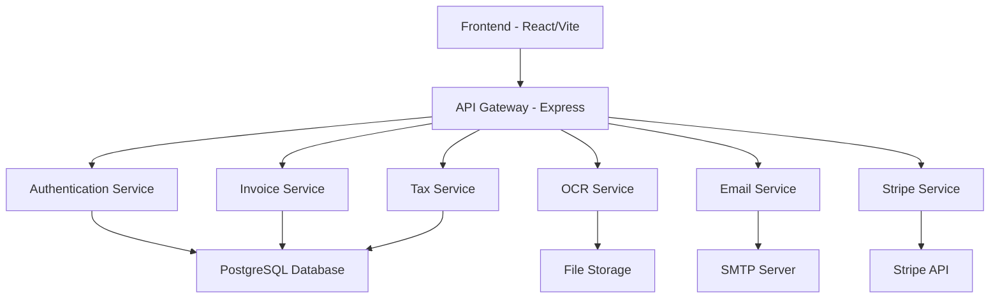
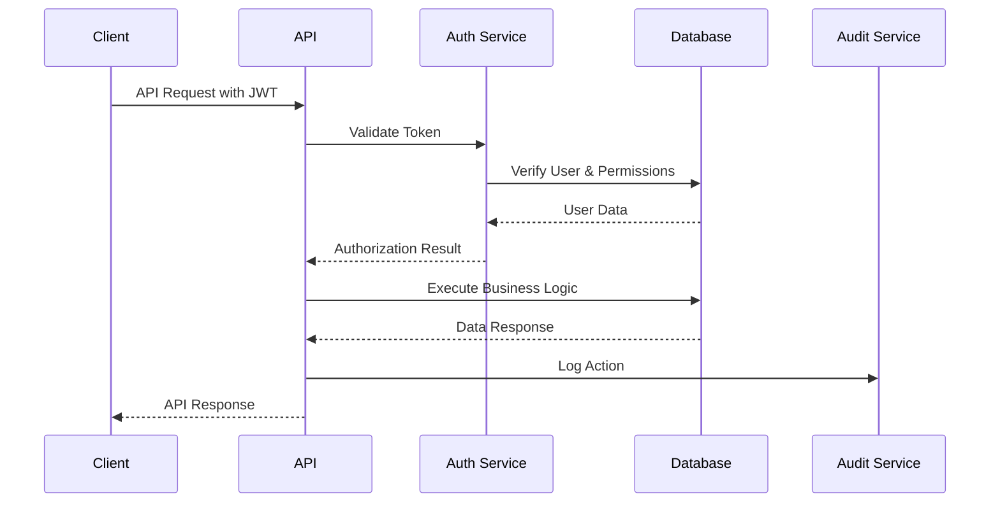
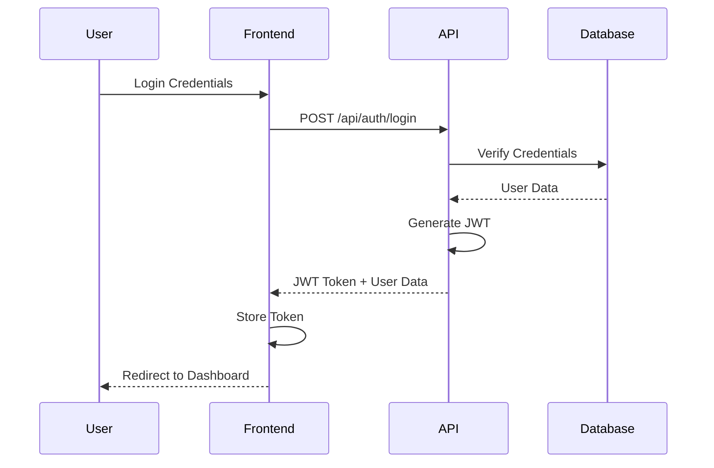
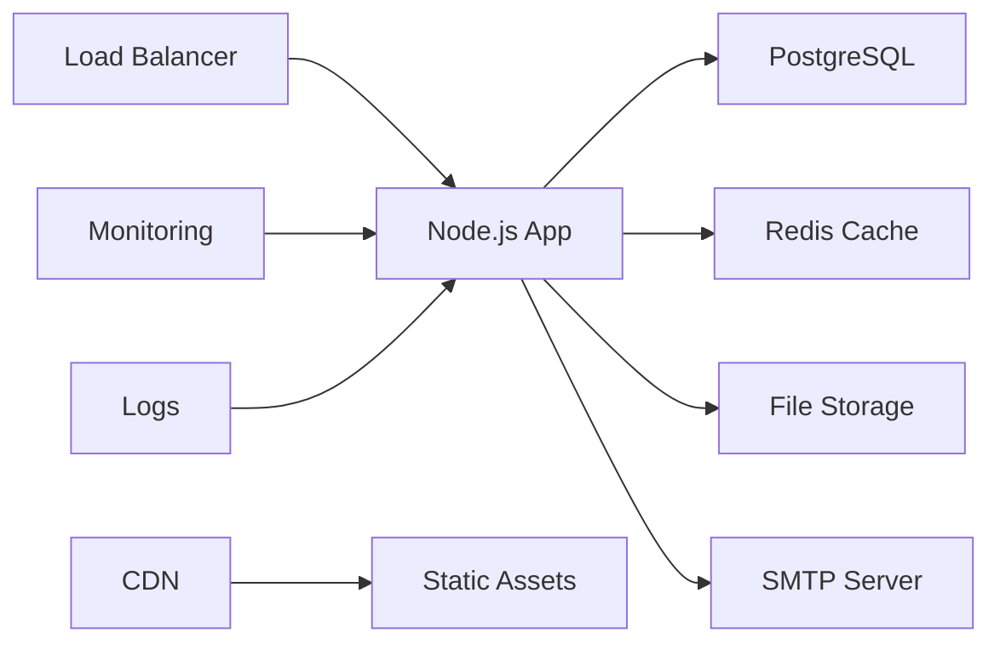

> Technical Architecture – Deep Dive  
> This document complements `02_SYSTEM_ARCHITECTURE.md`

# 🏗️ SmartAccounting - System Architecture

## 📋 Table of Contents

1. [Overview](#overview)
2. [System Components](#system-components)
3. [Data Architecture](#data-architecture)
4. [Security Architecture](#security-architecture)
5. [API Design](#api-design)
6. [Frontend Architecture](#frontend-architecture)
7. [Deployment Architecture](#deployment-architecture)

## Overview

SmartAccounting is a multi-tenant, role-based accounting system designed specifically for the German market with international expansion capabilities. The architecture follows microservices principles with a monolithic deployment for simplicity.

### Key Architectural Principles

- **Multi-tenancy**: Company-based data isolation
- **Security-First**: JWT authentication, RBAC, input validation
- **Scalability**: Modular design for horizontal scaling
- **Compliance**: German tax law adherence (DATEV, GoBD)
- **Internationalization**: Multi-language support
- **API-First**: RESTful API design

## System Components



### Backend Services

#### Core Services
- **Authentication Service**: User management, JWT tokens, RBAC
- **Invoice Service**: Invoice CRUD, PDF generation, client management
- **Tax Service**: German tax calculations, VAT handling, reports
- **Company Service**: Multi-tenant management, settings
- **Audit Service**: Compliance logging, trail management

#### Integration Services
- **OCR Service**: Document processing, data extraction
- **Email Service**: Notifications, alerts, templates
- **Stripe Service**: Subscription management, billing
- **Bank Statement Service**: Transaction import, reconciliation

### Frontend Components

```
client/src/
├── components/          # Reusable UI components
├── pages/              # Route-based page components
├── context/            # React context providers
├── hooks/              # Custom React hooks
├── services/           # API communication
└── lib/                # Utilities and helpers
```

## Data Architecture

### Database Schema

#### Core Entities

```sql
-- Users with role-based access
Users
├── id (UUID, Primary Key)
├── email (Unique)
├── password_hash
├── role (admin, accountant, auditor, viewer)
├── company_id (Foreign Key)
└── settings (JSON)

-- Multi-tenant companies
Companies
├── id (UUID, Primary Key)
├── name
├── tax_number
├── vat_number
├── settings (JSON)
└── subscription_status

-- Invoice management
Invoices
├── id (UUID, Primary Key)
├── company_id (Foreign Key)
├── invoice_number
├── client_name
├── amount
├── vat_amount
├── status
└── due_date

-- Audit trail for compliance
AuditLogs
├── id (UUID, Primary Key)
├── user_id (Foreign Key)
├── action
├── resource_type
├── resource_id
├── details (JSON)
└── timestamp
```

#### Relationships

- **One-to-Many**: Company → Users, Company → Invoices
- **Many-to-One**: Users → Company, Invoices → Company
- **Polymorphic**: AuditLogs → Any Entity

### Data Flow



## Security Architecture

### Authentication Flow



### Authorization Layers

1. **Route-Level**: JWT token validation
2. **Resource-Level**: Company-based data isolation
3. **Action-Level**: Role-based permissions
4. **Field-Level**: Sensitive data filtering

### Security Middleware Stack

```javascript
// Security middleware order
app.use(helmet());              // Security headers
app.use(cors(corsOptions));     // CORS configuration
app.use(rateLimiter);          // Rate limiting
app.use(inputValidation);      // Input sanitization
app.use(jwtAuthentication);    // JWT validation
app.use(rbacAuthorization);    // Role-based access
```

## API Design

### RESTful Conventions

```
Resource: /api/invoices
├── GET    /                    # List invoices
├── POST   /                    # Create invoice
├── GET    /:id                 # Get specific invoice
├── PUT    /:id                 # Update invoice
├── DELETE /:id                 # Delete invoice
└── POST   /:id/send            # Custom action
```

### Response Format

```json
{
  "status": "success|error",
  "data": {
    // Response payload
  },
  "meta": {
    "page": 1,
    "limit": 20,
    "total": 100
  },
  "error": {
    "code": "VALIDATION_ERROR",
    "message": "Human readable error",
    "details": []
  }
}
```

### Error Handling

```javascript
// Error response structure
{
  "status": "error",
  "error": {
    "code": "INVOICE_NOT_FOUND",
    "message": "Invoice with ID 123 not found",
    "details": {
      "invoiceId": "123",
      "company": "ABC Corp"
    }
  }
}
```

## Frontend Architecture

### Component Hierarchy

```
App
├── AuthProvider (Context)
├── Router
│   ├── PublicRoutes
│   │   ├── Login
│   │   └── Pricing
│   └── ProtectedRoutes
│       ├── Dashboard
│       ├── Invoices
│       ├── TaxReports
│       └── Settings
```

### State Management

- **Authentication**: React Context + localStorage
- **API Data**: Custom hooks with caching
- **Form State**: Local component state
- **Global Settings**: React Context

### API Integration

```javascript
// Custom API hook pattern
const useInvoices = () => {
  const [data, setData] = useState([]);
  const [loading, setLoading] = useState(false);
  const [error, setError] = useState(null);

  const fetchInvoices = useCallback(async () => {
    // API call implementation
  }, []);

  return { data, loading, error, fetchInvoices };
};
```

## Deployment Architecture

### Production Environment



### Replit Deployment

```
Repl Structure
├── Backend (Node.js/Express)
├── Frontend (React/Vite)
├── Database (PostgreSQL)
├── File Storage (Local/Cloud)
└── Environment (Secrets)
```

### Environment Configuration

```bash
# Production Environment Variables
NODE_ENV=production
PORT=5000
DATABASE_URL=postgresql://...
JWT_SECRET=secure-random-string
FRONTEND_URL=https://app.domain.com

# External Services
EMAIL_HOST=smtp.provider.com
STRIPE_SECRET_KEY=<stripe-secret-key>
OCR_API_KEY=ocr-service-key
```

## Performance Considerations

### Database Optimization
- Indexed foreign keys
- Query optimization
- Connection pooling
- Read replicas for reporting

### Caching Strategy
- Redis for session storage
- Application-level caching
- CDN for static assets
- Browser caching headers

-### Monitoring & Logging
- Context-aware structured logging that merges AsyncLocalStorage metadata, streams to `logs/combined.log` + `logs/error.log`, and sanitizes sensitive fields before emitting console output
- Error tracking (Sentry)
- Performance monitoring (APM)
- Health check endpoints

## Compliance & Auditing

### German Tax Compliance (GoBD)
- Immutable audit trail
- Complete transaction logging
- Data retention policies
- Export capabilities (DATEV)

### GDPR Compliance
- Data minimization
- Right to erasure
- Data portability
- Consent management

### Audit Trail
```javascript
// Every action logged
{
  "userId": "user-uuid",
  "action": "INVOICE_CREATED",
  "resourceType": "INVOICE",
  "resourceId": "invoice-uuid",
  "details": {
    "invoiceNumber": "INV-2024-001",
    "amount": 1234.56
  },
  "timestamp": "2024-01-15T10:30:00.000Z",
  "ipAddress": "192.168.1.1"
}
